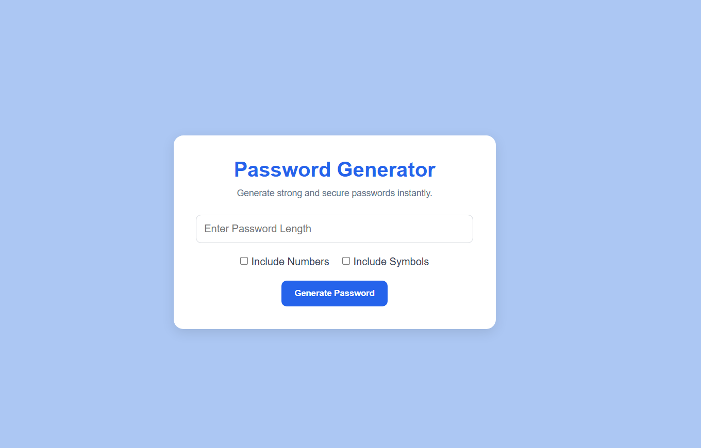
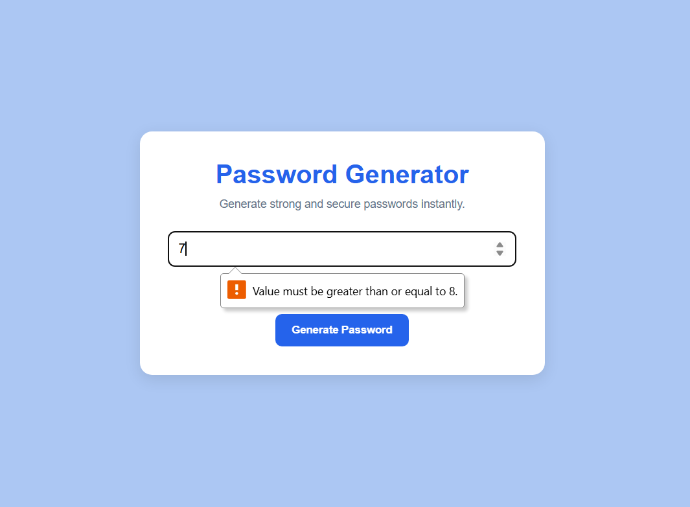
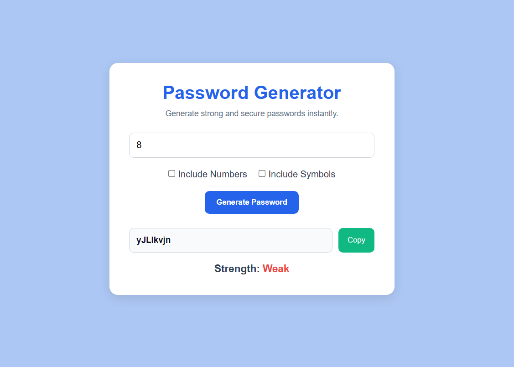
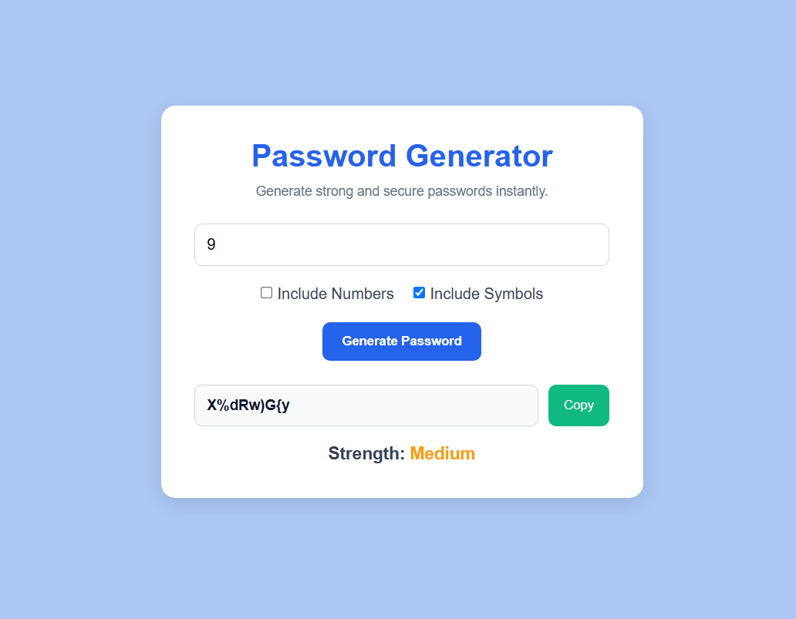
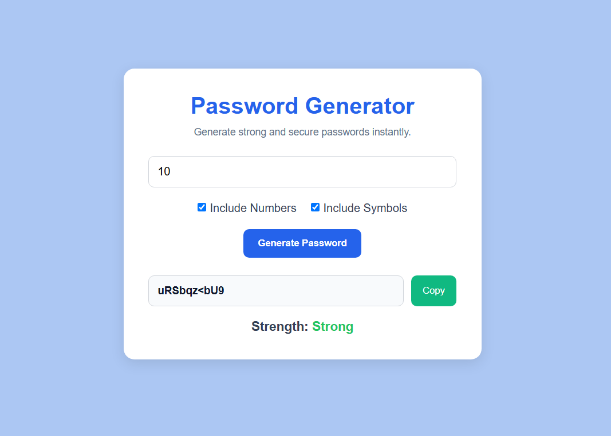

# Password Generator
A simple and secure Password Generator web application built using Python, Flask, HTML, CSS, and JavaScript. This application allows users to generate strong passwords with customizable options such as password length, numbers, and special symbols.

---

## Features

- Generate secure random passwords
- User-friendly GUI
- Include numbers option
- Include symbols option
- Password strength checker
- Copy password functionality
- Input validation

---

## Technologies Used

- Python
- Flask
- HTML5
- CSS3
- JavaScript

---


##  Project Structure

```text
password-generator/
│
├── app.py
│
├── templates/
│   └── index.html
│
├── static/
│   └── style.css
|
|__Screenshots
|
└── README.md
```

---

##  Installation

1. Clone the repository

```bash
git clone  https://github.com/ishaa-305/Password-Generator
```

2. Navigate to the project folder

```bash
cd password-generator
```

3. Install Flask

```bash
pip install flask
```

4. Run the application

```bash
python app.py
```

5. Open your browser and visit

```text
http://127.0.0.1:5000
```

---

## Screenshots

### Application Interface








## Author

Developed by Isha Dwivedi

---
